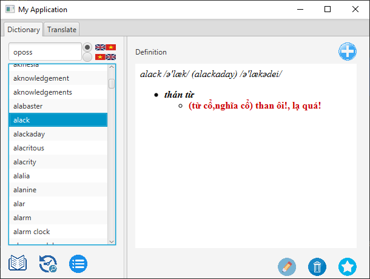

# UET_Dictionary_OOPProject
A Dictionary application written in JavaFX for OOP class INT 2204 UET.

***

## Code
With the help of Google Translate API and FreeTTS

***

## Run
* Set up the File/Project Structure/Libraries *(if IntelliJ is in used)* with all the given .jar files in lib/FreeTTS folder.
* Internet connection is obligatory for Translate feature.
* Run the application by executing `src/dictionary/Main.java`

***

_This project has not completed yet. This submission is for the grading._
